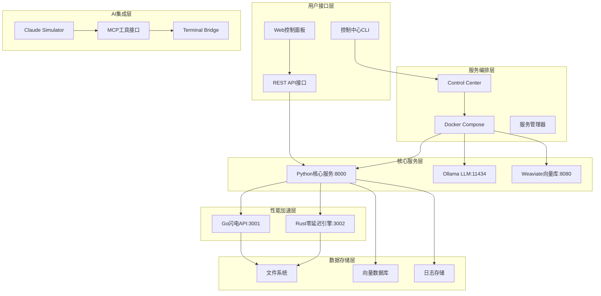

# 本地LLM项目优化设计文档

## 概述

本设计文档基于需求分析，提供了一个系统性的项目优化方案。设计目标是将现有的多语言AI监理系统重构为一个结构清晰、易于维护、高性能的统一平台。

### 设计原则

1. **向后兼容性**：确保现有功能在重构后仍然正常工作
2. **渐进式迁移**：分阶段实施，每步都可回滚和验证
3. **技术栈现代化**：使用最新稳定版本的技术栈
4. **统一管理**：通过单一入口管理所有服务和配置
5. **性能优先**：保持多语言性能优势，优化资源使用
6. **文档驱动**：完整的文档覆盖，便于维护和扩展

### 当前项目分析

**现状问题**：
- 存在重复代码：`ai_monitor/` 和 `ai-monitor-v2/` 两个版本
- 依赖管理混乱：多个 requirements.txt 文件，版本不统一
- 文档分散：多个 README 和架构文档，信息重复
- 服务管理复杂：多个启动脚本，缺乏统一管理

**技术资产**：
- 完整的 Claude Code 集成系统 (CCIS)
- 多语言性能层 (Python + Go + Rust)
- Docker 容器化基础设施
- 完善的控制中心脚本

## 架构设计

### 整体架构



### 目录结构设计

```
本地llm项目/
├── 🎮 控制中心
│   ├── control_center.sh              # 统一控制脚本
│   ├── docker-compose.yml             # 服务编排配置
│   ├── .env                          # 环境变量配置
│   └── scripts/                      # 辅助脚本
│       ├── install.sh                # 安装脚本
│       ├── health_check.sh           # 健康检查
│       └── backup.sh                 # 数据备份
│
├── 🤖 AI监理系统
│   └── ai-monitor/                   # 统一后的AI监理系统
│       ├── core/                     # Python核心服务
│       │   ├── api/                  # FastAPI应用
│       │   ├── services/             # 业务服务
│       │   ├── models/               # 数据模型
│       │   └── utils/                # 工具函数
│       ├── performance/              # 性能层
│       │   ├── go/                   # Go微服务
│       │   └── rust/                 # Rust引擎
│       ├── tests/                    # 测试套件
│       ├── configs/                  # 配置文件
│       └── requirements.txt          # Python依赖
│
├── 🔧 Claude Code集成
│   ├── claude_simulator.py           # 核心模拟器
│   ├── mcp_tools/                    # MCP工具集
│   │   ├── __init__.py
│   │   ├── executor.py               # 执行器
│   │   ├── bridge.py                 # 终端桥接
│   │   └── helpers.py                # 辅助函数
│   └── templates/                    # 代码模板
│
├── 📊 监控和日志
│   ├── logs/                         # 日志目录
│   ├── metrics/                      # 指标数据
│   └── monitoring/                   # 监控配置
│
├── 🐳 部署配置
│   ├── docker/                       # Docker配置
│   │   ├── Dockerfile.python         # Python服务镜像
│   │   ├── Dockerfile.go             # Go服务镜像
│   │   └── Dockerfile.rust           # Rust服务镜像
│   └── k8s/                         # Kubernetes配置(可选)
│
├── 📚 文档
│   ├── README.md                     # 主文档
│   ├── ARCHITECTURE.md               # 架构文档
│   ├── API.md                        # API文档
│   ├── DEPLOYMENT.md                 # 部署文档
│   └── DEVELOPMENT.md                # 开发文档
│
├── 🧪 测试和质量
│   ├── tests/                        # 测试套件
│   │   ├── unit/                     # 单元测试
│   │   ├── integration/              # 集成测试
│   │   └── performance/              # 性能测试
│   ├── .github/workflows/            # CI/CD配置
│   └── quality/                      # 代码质量工具
│
├── pyproject.toml                    # Python项目配置
├── poetry.lock                       # 依赖锁定文件
└── .gitignore                        # Git忽略配置
```

## 组件设计

### 1. 控制中心设计

**职责**：统一的服务管理和监控入口

**核心功能**：
- 服务生命周期管理（启动/停止/重启）
- 实时状态监控和健康检查
- 日志聚合和查看
- 配置管理和环境切换

**技术实现**：
```bash
# control_center.sh 核心架构
main_menu() {
    # 交互式菜单系统
    # 支持命令行参数和交互模式
}

service_manager() {
    # Docker Compose集成
    # 进程管理和监控
    # 健康检查和自动恢复
}

monitoring_dashboard() {
    # 实时状态显示
    # 资源使用监控
    # 日志实时查看
}
```

### 2. AI监理系统设计

**架构模式**：分层架构 + 微服务

**核心层次**：
1. **API层**：FastAPI + Pydantic数据验证
2. **服务层**：业务逻辑和AI集成
3. **数据层**：Weaviate向量库 + 文件存储
4. **性能层**：Go/Rust高性能组件

**关键设计决策**：
```python
# 统一的服务接口设计
class AIMonitorService:
    async def process_request(self, request: RequestModel) -> ResponseModel
    async def health_check(self) -> HealthStatus
    async def get_metrics(self) -> MetricsData

# 插件化架构
class PluginManager:
    def register_plugin(self, plugin: Plugin)
    def execute_plugin(self, plugin_name: str, data: Any)
```

### 3. Claude Code集成设计

**设计模式**：命令模式 + 策略模式

**核心组件**：
```python
# 命令执行器
class CommandExecutor:
    def execute(self, command: Command) -> Result
    def validate(self, command: Command) -> bool
    def rollback(self, command: Command) -> bool

# MCP工具接口
class MCPToolInterface:
    async def execute_claude_code(self, task: str) -> dict
    async def stream_execution(self, task: str) -> AsyncIterator[dict]
    async def batch_process(self, tasks: List[str]) -> List[dict]
```

### 4. 性能层设计

**Go微服务设计**：
```go
// 高并发API服务
type APIServer struct {
    router *gin.Engine
    config *Config
    metrics *Metrics
}

func (s *APIServer) HandleRequest(c *gin.Context) {
    // 请求处理逻辑
    // 性能监控
    // 错误处理
}
```

**Rust引擎设计**：
```rust
// 零延迟计算引擎
pub struct ComputeEngine {
    thread_pool: ThreadPool,
    cache: Arc<Mutex<Cache>>,
}

impl ComputeEngine {
    pub async fn process(&self, data: &[u8]) -> Result<Vec<u8>> {
        // 高性能计算逻辑
    }
}
```

## 数据模型设计

### 配置数据模型

```python
from pydantic import BaseModel, Field
from typing import Optional, Dict, List

class ServiceConfig(BaseModel):
    name: str
    port: int
    host: str = "localhost"
    environment: Dict[str, str] = {}
    dependencies: List[str] = []

class SystemConfig(BaseModel):
    services: List[ServiceConfig]
    logging: LoggingConfig
    monitoring: MonitoringConfig
    security: SecurityConfig
```

### API数据模型

```python
class APIRequest(BaseModel):
    action: str = Field(..., description="操作类型")
    parameters: Dict[str, Any] = Field(default_factory=dict)
    context: Optional[Dict[str, Any]] = None

class APIResponse(BaseModel):
    success: bool
    data: Optional[Dict[str, Any]] = None
    error: Optional[str] = None
    timestamp: datetime
    execution_time: float
```

## 错误处理设计

### 错误分类和处理策略

```python
class ErrorHandler:
    ERROR_CODES = {
        "SERVICE_UNAVAILABLE": "E001",
        "INVALID_REQUEST": "E002", 
        "AUTHENTICATION_FAILED": "E003",
        "RESOURCE_NOT_FOUND": "E004",
        "INTERNAL_ERROR": "E005"
    }
    
    def handle_error(self, error: Exception) -> ErrorResponse:
        # 错误分类和处理
        # 日志记录
        # 用户友好的错误信息
```

### 重试和恢复机制

```python
@retry(max_attempts=3, backoff_factor=2)
async def resilient_service_call(service_name: str, request: dict):
    # 带重试的服务调用
    # 断路器模式
    # 降级处理
```

## 测试策略设计

### 测试金字塔

```python
# 单元测试 (70%)
class TestAIMonitorService:
    def test_process_request(self):
        # 核心业务逻辑测试
    
    def test_error_handling(self):
        # 错误处理测试

# 集成测试 (20%)
class TestServiceIntegration:
    def test_service_communication(self):
        # 服务间通信测试
    
    def test_database_integration(self):
        # 数据库集成测试

# 端到端测试 (10%)
class TestE2E:
    def test_complete_workflow(self):
        # 完整工作流测试
```

### 性能测试设计

```python
# 负载测试
async def load_test():
    # 并发请求测试
    # 资源使用监控
    # 性能基准验证

# 压力测试  
async def stress_test():
    # 极限负载测试
    # 故障恢复测试
    # 内存泄漏检测
```

## 安全设计

### 安全架构

```python
class SecurityManager:
    def authenticate(self, credentials: dict) -> bool:
        # 身份认证
    
    def authorize(self, user: User, resource: str, action: str) -> bool:
        # 权限控制
    
    def encrypt_sensitive_data(self, data: str) -> str:
        # 敏感数据加密
    
    def audit_log(self, action: str, user: str, resource: str):
        # 审计日志
```

### 网络安全

- 服务间通信加密（TLS）
- API访问控制（JWT Token）
- 输入验证和SQL注入防护
- 跨站脚本攻击（XSS）防护

## 监控和可观测性设计

### 指标收集

```python
from prometheus_client import Counter, Histogram, Gauge

# 业务指标
request_count = Counter('api_requests_total', 'API请求总数')
request_duration = Histogram('api_request_duration_seconds', 'API请求耗时')
active_connections = Gauge('active_connections', '活跃连接数')

# 系统指标
cpu_usage = Gauge('system_cpu_usage_percent', 'CPU使用率')
memory_usage = Gauge('system_memory_usage_bytes', '内存使用量')
```

### 日志设计

```python
import structlog

logger = structlog.get_logger()

# 结构化日志
logger.info(
    "API请求处理完成",
    endpoint="/api/v1/process",
    method="POST",
    status_code=200,
    duration=0.123,
    user_id="user123"
)
```

### 分布式追踪

```python
from opentelemetry import trace

tracer = trace.get_tracer(__name__)

@tracer.start_as_current_span("process_request")
def process_request(request):
    # 请求处理逻辑
    # 自动生成追踪信息
```

## 部署设计

### Docker化策略

```dockerfile
# 多阶段构建
FROM python:3.12-slim as builder
WORKDIR /app
COPY requirements.txt .
RUN pip install --no-cache-dir -r requirements.txt

FROM python:3.12-slim as runtime
WORKDIR /app
COPY --from=builder /usr/local/lib/python3.12/site-packages /usr/local/lib/python3.12/site-packages
COPY . .
EXPOSE 8000
CMD ["uvicorn", "main:app", "--host", "0.0.0.0", "--port", "8000"]
```

### 服务编排

```yaml
# docker-compose.yml
version: '3.9'
services:
  ai-monitor:
    build: ./ai-monitor
    ports:
      - "8000:8000"
    environment:
      - DATABASE_URL=${DATABASE_URL}
    depends_on:
      - weaviate
      - ollama
    healthcheck:
      test: ["CMD", "curl", "-f", "http://localhost:8000/health"]
      interval: 30s
      timeout: 10s
      retries: 3
```

## 迁移策略

### 具体迁移计划

#### 1. 项目结构迁移
```bash
# 当前结构 → 目标结构
ai_monitor/                    → 删除 (合并到统一版本)
ai-monitor-v2/                → ai-monitor/ (重命名为主版本)
claude_simulator.py           → claude_code/claude_simulator.py
claude_code_mcp_tool.py       → claude_code/mcp_tools/executor.py
claude_terminal_bridge.py     → claude_code/mcp_tools/bridge.py
control_center.sh             → 保留并增强
docker-compose.yml            → 优化配置
```

#### 2. 依赖统一迁移
```bash
# 合并依赖文件
requirements.txt              → 分析并合并
ai-monitor-v2/requirements.txt → 分析并合并
pyproject.toml                → 创建统一配置

# 版本统一策略
FastAPI: 0.116.1 (使用最新版本)
Pydantic: 2.11.7 (使用v2最新版本)
Python: 3.12+ (统一使用最新稳定版)
```

#### 3. 服务端口标准化
```yaml
# 端口分配标准化
Python核心服务: 8000    # 主API服务
Ollama LLM: 11434       # LLM推理服务
Weaviate: 8080          # 向量数据库
Go API: 3001            # 高性能API
Rust引擎: 3002          # 计算引擎
Web控制面板: 5005       # 管理界面
```

### 渐进式迁移实施

```python
# 迁移脚本设计
class ProjectMigrationManager:
    def __init__(self, project_root: Path):
        self.project_root = project_root
        self.backup_dir = project_root / "backup"
        self.migration_log = []
    
    def create_backup(self):
        """创建完整项目备份"""
        timestamp = datetime.now().strftime("%Y%m%d_%H%M%S")
        backup_path = self.backup_dir / f"backup_{timestamp}"
        shutil.copytree(self.project_root, backup_path, 
                       ignore=shutil.ignore_patterns('*.pyc', '__pycache__'))
        return backup_path
    
    def migrate_ai_monitor(self):
        """合并AI监理系统版本"""
        # 1. 分析两个版本的差异
        old_version = self.project_root / "ai_monitor"
        new_version = self.project_root / "ai-monitor-v2"
        
        # 2. 保留新版本，合并有用的旧版本代码
        useful_files = self._analyze_useful_files(old_version, new_version)
        
        # 3. 重命名新版本为标准名称
        target_dir = self.project_root / "ai-monitor"
        new_version.rename(target_dir)
        
        # 4. 清理旧版本
        if old_version.exists():
            shutil.rmtree(old_version)
    
    def migrate_dependencies(self):
        """统一依赖管理"""
        # 收集所有requirements文件
        req_files = list(self.project_root.glob("**/requirements.txt"))
        
        # 分析依赖冲突
        all_deps = self._collect_dependencies(req_files)
        resolved_deps = self._resolve_conflicts(all_deps)
        
        # 创建统一的pyproject.toml
        self._create_pyproject_toml(resolved_deps)
        
        # 清理旧的requirements文件
        for req_file in req_files:
            req_file.unlink()
    
    def migrate_claude_code(self):
        """重构Claude Code集成"""
        claude_files = [
            "claude_simulator.py",
            "ai_monitor/scaffold/claude_code_mcp_tool.py",
            "claude_terminal_bridge.py"
        ]
        
        # 创建新的claude_code目录结构
        claude_dir = self.project_root / "claude_code"
        claude_dir.mkdir(exist_ok=True)
        
        mcp_tools_dir = claude_dir / "mcp_tools"
        mcp_tools_dir.mkdir(exist_ok=True)
        
        # 移动和重构文件
        self._restructure_claude_files(claude_files, claude_dir)
    
    def validate_migration(self):
        """验证迁移结果"""
        checks = [
            self._check_directory_structure(),
            self._check_dependencies(),
            self._check_service_configs(),
            self._check_documentation()
        ]
        
        return all(checks)
```

### 配置迁移策略

```python
# 配置统一管理
class ConfigManager:
    def __init__(self):
        self.config_schema = {
            "services": {
                "python_core": {"port": 8000, "host": "0.0.0.0"},
                "ollama": {"port": 11434, "host": "localhost"},
                "weaviate": {"port": 8080, "host": "localhost"},
                "go_api": {"port": 3001, "host": "localhost"},
                "rust_engine": {"port": 3002, "host": "localhost"}
            },
            "logging": {
                "level": "INFO",
                "format": "structured",
                "rotation": "daily"
            },
            "monitoring": {
                "enabled": True,
                "metrics_port": 9090,
                "health_check_interval": 30
            }
        }
    
    def migrate_configs(self):
        """迁移现有配置到统一格式"""
        # 收集现有配置
        existing_configs = self._collect_existing_configs()
        
        # 合并到统一schema
        unified_config = self._merge_configs(existing_configs)
        
        # 生成新的配置文件
        self._generate_config_files(unified_config)
```

## 质量保证

### 代码质量工具

```toml
# pyproject.toml
[tool.black]
line-length = 88
target-version = ['py312']

[tool.isort]
profile = "black"
multi_line_output = 3

[tool.mypy]
python_version = "3.12"
warn_return_any = true
warn_unused_configs = true
```

### CI/CD流水线

```yaml
# .github/workflows/ci.yml
name: CI/CD Pipeline
on: [push, pull_request]
jobs:
  test:
    runs-on: ubuntu-latest
    steps:
      - uses: actions/checkout@v3
      - name: Setup Python
        uses: actions/setup-python@v4
        with:
          python-version: '3.12'
      - name: Install dependencies
        run: poetry install
      - name: Run tests
        run: poetry run pytest
      - name: Code quality check
        run: |
          poetry run black --check .
          poetry run isort --check-only .
          poetry run mypy .
```

## 性能优化设计

### 缓存策略

```python
from functools import lru_cache
import redis

# 内存缓存
@lru_cache(maxsize=1000)
def expensive_computation(param: str) -> str:
    # 计算密集型操作

# Redis缓存
class CacheManager:
    def __init__(self):
        self.redis_client = redis.Redis()
    
    async def get_or_set(self, key: str, factory: Callable) -> Any:
        # 缓存获取或设置
```

### 异步处理

```python
import asyncio
from concurrent.futures import ThreadPoolExecutor

class AsyncProcessor:
    def __init__(self):
        self.executor = ThreadPoolExecutor(max_workers=10)
    
    async def process_batch(self, items: List[Any]) -> List[Any]:
        # 批量异步处理
        tasks = [self.process_item(item) for item in items]
        return await asyncio.gather(*tasks)
```

## 扩展性设计

### 插件系统

```python
class PluginInterface:
    def initialize(self, config: dict) -> None:
        # 插件初始化
    
    def process(self, data: Any) -> Any:
        # 数据处理
    
    def cleanup(self) -> None:
        # 资源清理

class PluginManager:
    def load_plugin(self, plugin_path: str) -> PluginInterface:
        # 动态加载插件
    
    def execute_plugins(self, data: Any) -> Any:
        # 执行插件链
```

### 微服务架构准备

```python
# 服务发现
class ServiceRegistry:
    def register_service(self, name: str, endpoint: str) -> None:
        # 服务注册
    
    def discover_service(self, name: str) -> str:
        # 服务发现

# 负载均衡
class LoadBalancer:
    def get_endpoint(self, service_name: str) -> str:
        # 负载均衡选择
```

这个设计文档提供了一个全面的技术架构和实现方案，确保项目优化后具有良好的可维护性、扩展性和性能。