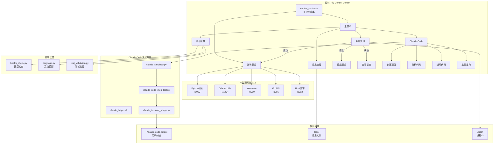
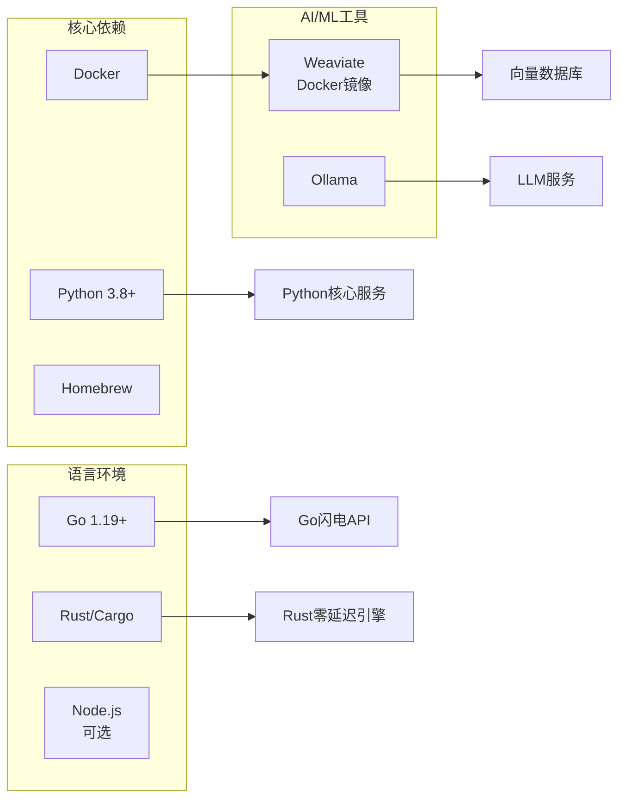
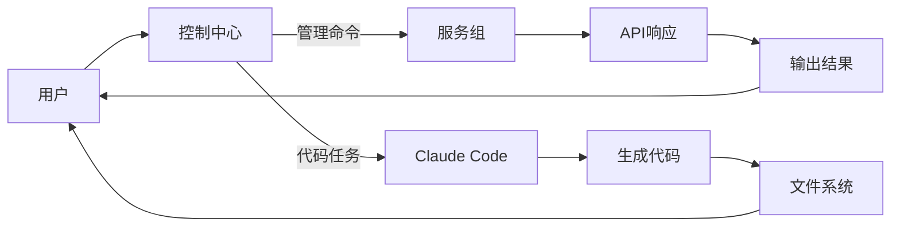
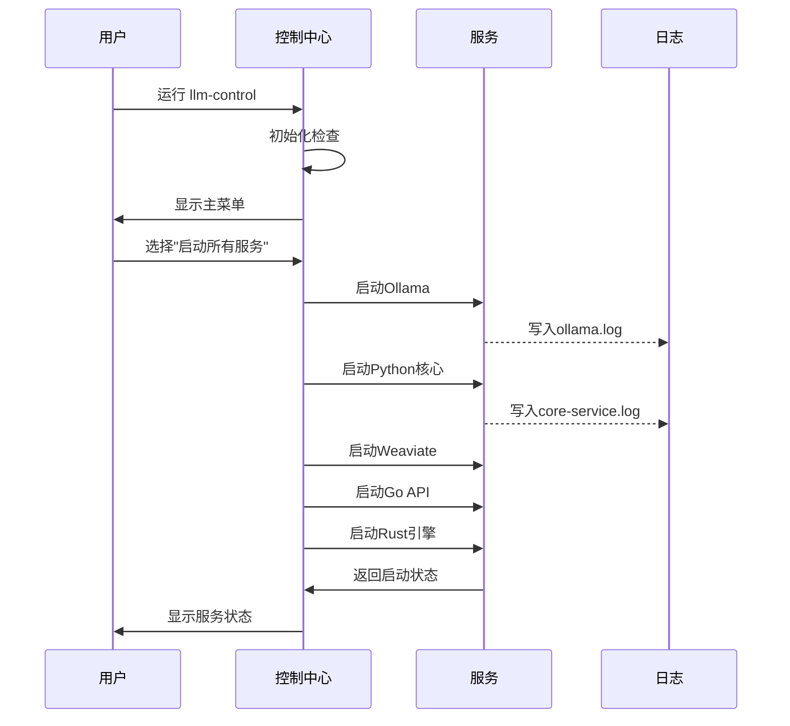

# 本地LLM项目 - 系统架构图

## 控制中心架构



## 服务依赖关系



## 数据流向



## 启动流程



## 文件组织结构

```
/Users/imac/Documents/编程/项目/本地llm项目/
│
├── 🎮 控制中心
│   ├── control_center.sh          # 主控制脚本
│   ├── install_control_center.sh  # 安装脚本
│   └── service_groups.conf        # 服务配置
│
├── 🤖 AI监理系统
│   └── ai-monitor-v2/
│       ├── core/                  # Python核心
│       ├── performance/           # Go/Rust组件
│       └── logs/                  # 服务日志
│
├── 🔧 Claude Code集成
│   ├── claude_simulator.py        # 模拟器
│   ├── claude_code_mcp_tool.py   # MCP接口
│   ├── claude_helper.sh          # CLI助手
│   └── claude_terminal_bridge.py  # 终端桥接
│
├── 🩺 诊断工具
│   ├── health_check.py           # 健康检查
│   ├── diagnose.py               # 系统诊断
│   └── test_validation.py        # 测试验证
│
├── 📚 文档
│   ├── README.md                 # 项目说明
│   ├── CONTROL_CENTER_README.md  # 控制中心文档
│   └── *.md                      # 其他文档
│
└── 📂 输出目录
    ├── ~/claude-code-output/     # 代码输出
    └── .pids/                    # 进程管理
```

---

这个架构图展示了整个系统的组织结构和相互关系。控制中心是所有组件的统一入口。
